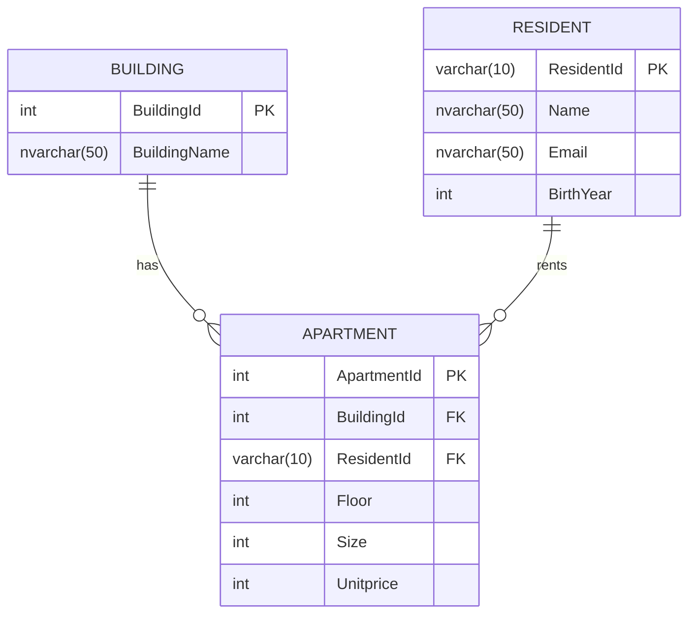
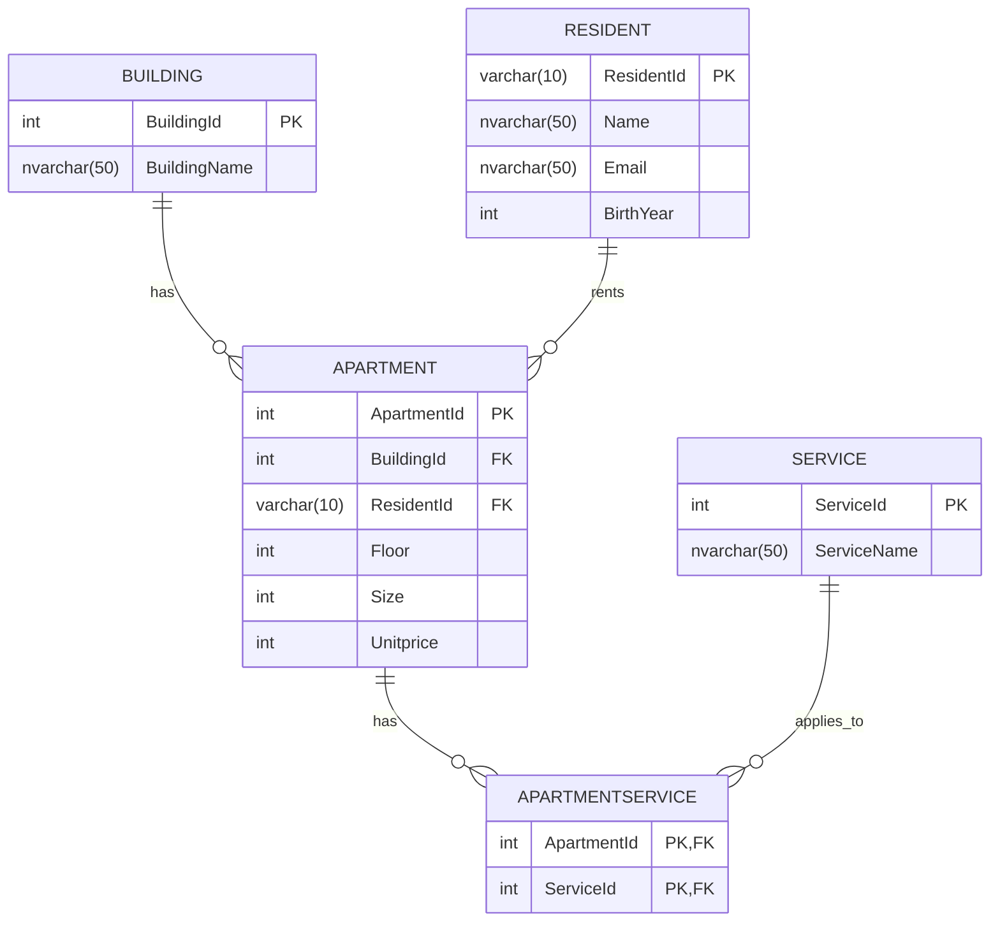

import DownloadLink from "../components/DownloadLink.tsx";
import apartmentsCsv from "../assets/apartments.csv";
import newAptsXml from "../assets/newapts.xml";

# Apartments

- [ ] **1.** Import  <DownloadLink href={apartmentsCsv} downloadName="apartments.csv">the csv</DownloadLink>  with the Import Flat File Wizard. In the wizard, don’t forget to set the datatypes to `nvarchar(50)` and allow nulls on the imported table.

- [ ] **2.** Based on the diagram below, create a table structure. The `BuildingId` should be identity, only `ResidentId` is nullable.

- [ ] **3.** Import unique building data into the Building table and unique Resident data into the Resident table.

- [ ] **4.** Fill up the Apartments table. For this, you must use the already populated building table also to get the Building IDs.

- [ ] **5.** The services column in the imported table contains a comma-separated string. Extract the M:N relationship and populate the tables.
  • The name for the table which stores the unique service values: Service.
  • The name for the junction table: `ApartmentService`.
  (refer the final database model for more information)

- [ ] **6.** Add an appropriate constraint to the birthyear column in the Resident table. The constraint ensures that the value is less than or equal to the current year minus 18 years.

- [ ] **7.** Create a function which calculates the apartment-level fee. Two input parameters: `Unitprice` and `SquareMeters`. Return the fee, which is the unitprice*square meters + 10%.

- [ ] **8.** Write a query which calculates the count of apartments and the sum of achievable rental fees per building. Order the query based on the count of flats descending. Use the previously created function for maximum points.

- [ ] **9.** Based on the previously created table, create a view with a name `vwBuildingApts`.

- [ ] **10.** We have received new building and apartment data <DownloadLink href={newAptsXml} downloadName="newapts.xml">in an xml file</DownloadLink>. Load the xml into a variable. With an xml query, save the data into a temporary table. Insert the new unique buildings into the building, the new apartments into the apartment table.
  

---

## **Final database structure**

