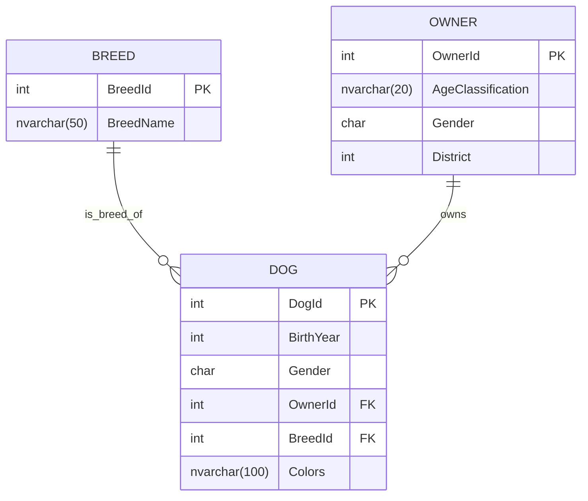
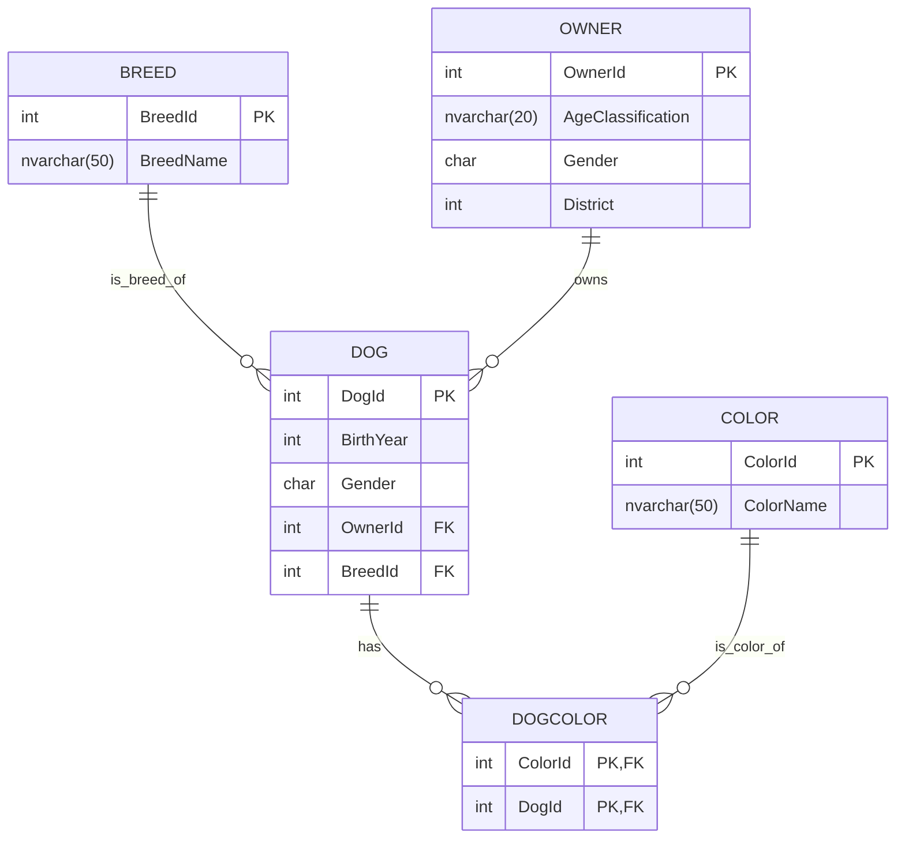

import DownloadLink from "../components/DownloadLink.tsx";
import dogsCsv from "../assets/dogs.csv";

# Dogs

- [ ] **1.** Import <DownloadLink href={dogsCsv} downloadName="dogs.csv">the csv</DownloadLink> with the Import Flat File Wizard. In the wizard, don’t forget to set the datatypes to `nvarchar(50)` and allow nulls on the imported table.


- [ ] **2.** Create the following table structure (the `Dog.DogId` and `Breed.BreedId` are `IDENTITY` fields).



- [ ] **3.** Import unique dog breed data into the Breed table, unique owner data into the Owner table.

- [ ] **4.** Fill up the Dog table. For this, you must use the already populated Breed table also to get the Breed IDs.

- [ ] **5.** The colors column of the dog table contains dog color information separated by slash. Extract the M:N relationship, populate the tables, then remove the column from the Dog table.
  • The name for the table which stores the unique color values: Color.
  • The name for the junction table: DogColor.
  (refer to the final database model for more information, don’t forget to set the keys!)

- [ ] **6.** Add two appropriate constraints to the Dog and to the Owner table. The constraint should ensure that the Gender column only accepts the values 'f' or 'm'.

- [ ] **7.** Create a function that converts the abbreviations 'f' and 'm' to their full forms 'female' and 'male'. The function should have one input parameter: gender, and return the corresponding full form of the gender.

- [ ] **8.** Create a query which calculates the count of the female and male dogs. Order by the count descending.
  Use the previously created function for maximum points.

- [ ] **9.** Based on the previously (8) created query, create a view with a name vwDogGenderCount.

- [ ] **10.** Create a query which produces the following xml:

```xml
<Dogs>
    <Dog id="1">
        <Birthyear>2011</Birthyear>
        <Gender>male</Gender>
        <BreedName>Appenzeller</BreedName>
        <Owner>
            <Ownerid>108060</Ownerid>
            <AgeClass>21-30</AgeClass>
            <District>4</District>
            <Gender>female</Gender>
        </Owner>
    </Dog>
    <Dog id="2">
        (...)
    </Dog>
</Dogs>
```


